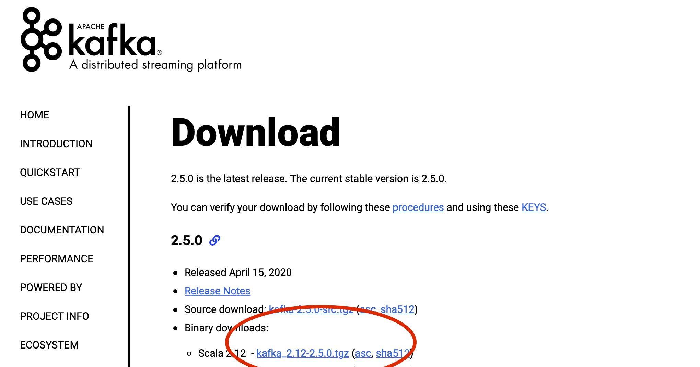
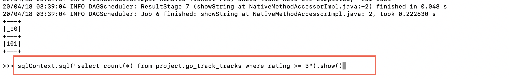

# DATA PIPELINE TO PROCESS REALTIME EVENTS IN CARPOOLING
## Author: Sri Harsha Vardhan Pathuri, Mukul Gulati, Mahateesh Rao Venepally

-[ABSTRACT](#ABSTRACT)
-[INTRODUCTION](#INTRODUCTION)
-[LITERATURE SURVEY](#LITERATURE SURVEY)
	-[DATA SOURCE](#DATA SOURCE)
	-[KAFKA STREAM](#KAFKA STREAM)
	-[HADOOP](#HADOOP)
		-[HDFS DATA STORE](#HDFS DATA STORE)
		-[HIVE](#HIVE)
	-[UBER ENGINEERING](#UBER ENGINEERING)
-[SYSTEM ANALYSIS](#SYSTEM ANALYSIS)
	-[Raw Data](#Raw Data)
	-[Kafka Queue](#Kafka Queue)
	-[Data Parttitioning with SPARK](#Data Parttitioning with SPARK)
	-[Hadoop](#Hadoop)
	-[Real Time Processing](#Real Time Processing)
		-[Mapping the Real Time data](#Mapping the Real Time data)
		-[Matching the driver and the rider in the real time](#Matching the driver and the rider in the real time)
-[CODING AND TESTING](#CODING AND TESTING)
	-[Source Data Manipulations](#Source Data Manipulations)
	-[Apache Kafka](#Apache Kafka)
	-[Real Time Processing](#Real Time Processing)
	-[Data Store for Future Analysis](#Data Store for Future Analysis)
-[CONCLUSION](#CONCLUSION)
-[CHALLENGES FACED](#CHALLENGES FACED)
-[MEMEBER CONTRIBUTION](#MEMEBER CONTRIBUTION)
	-[MahateeshRao Venepally’s Contribution:](#MahateeshRao Venepally’s Contribution:)
	-[Mukul Gulati’s Contribution:](#Mukul Gulati’s Contribution:)
	-[Sri Harsha Vardhan Pathuri’s Contribution:](#Sri Harsha Vardhan Pathuri’s Contribution:)
-[FUTURE ENHANCEMENTS](#FUTURE ENHANCEMENTS)
-[REFERENCES](#REFERENCES)
-[APPENDIX](#APPENDIX)


# ABSTRACT


In this globalized world, traffic has become one of the biggest problems to tackle in most of the metropolitan  cities. So, to avoid traffic, most  of  the people  are shifting to carpooling services. In a carpooling service, mapping of customers to a driver would need an effective data pipeline to handle the huge data generated in real time. In this project we are creating a data pipeline which helps in matching the nearest car driver to the customer in a carpooling application and also saving the information into a databasefor future analytics. The raw data used for this project would include information of thedrivers   as   well  as   the  customers   in  a carpooling   application.   The  data   wouldspecify the real time location, the type of booking required by the customer and also thelocation  of   the driver,   the  type   of  vehicle  being   driven  by   the  driver.  The   raw  data obtained are the real time events which are generated only once. So, these events areprocessed first into a Kafka queue initially for further processing. The data in Kafka is processed by cleaning and transforming to load it into Apache ORC store. From this,the   data   is   partitioned   using   spark   and   it   is   stored   into   Hadoop   database.   Datapartitioning is done for future analysis in making hassle free queries of the customersand the drivers with respect to their rides and locations. The data from apache ORCstore is also processed into real time database which processes the locations of thecustomers and the drivers to map the nearest driver to the customers with respect totheir location. As the mapping is done in real time database, it has to be stored intoHadoop database for future analysis. This information is again partitioned using spark and then stored into Hadoop database. Apache ORC store is mainly used to handle thecases like server crash in either Hadoop or real time database. So, when is server crashis faced in any of the above mentioned systems, apache ORC provides a backup ofcleaned and transformed data which reduces the tedious job of again handling the rawdata from Kafka queue. The flow of data in this pipeline is processed in batches with abandwidth  of  certain  time  period.  In  future,  the  increase  in   data   flow  can   be  easilyhandled by adding the nodes to real time database and Hadoop.


# INTRODUCTION


This project is about a car pooling application, where we match the customer and the driver in a real time environment using Eucledian distance and time stamp.For this we used several different technologies for different purposes such as pipe lining the data, pushing the data document by document in the database from the JSON file etc.
There is a huge amount of data of rider and driver which specifies the real time location, the type of booking required by the customer and also the location  of   the driver,   the  type   of  vehicle  being   driven  by the  driver. As this real time data is colleted, so as to use this data skillfully we process the data in  Apache Kafka,which is a distributed messaging system providing fast, highly scalable and redudant messaging thorugh a pub-sub model.Here we use the rider and customer data as the producer data and the database as the consumer of the data. In the Kafka system we create a certain number of brokers and parititions in those brokers to process the data efficiently without missing any message from the producer. The main reason for us to use Kafka over other technologies is that in Kafka we can do parallel processing which eventually leads to increased message throughput. The data from the kafka Queue is passed on to two different paths. At one end the real-time processing of the data takes place with respect to the location of the rider and the customer. Once a match is made based on the Eucledian Distance we send that message to the Apache spark where the partitioning of the data takes place and is stored in the Hadoop File System which is the main database for this project. At the other path the data is directly pushed onto the Apache Spark where the data is partitioned and is stored in the HDFS for future analysis on the data. Data partitioning is done for future analysis in making hassle free queries of the customers and the drivers with respect to their rides and locations. Here we are using Apache Spark as it runs the applications much faster by reducing the read-write cycles and storing the intermediate data in memory. The main purpose of using HDFS as our main Database over  is because it is very fast,resilient to failure and flexible.


# LITERATURE SURVEY

## DATA SOURCE


To simulate the model we need a realtime application which helps us in streaming the live location. As of now we don't have a proper source application. So, with the help of repositories developed by a UBER software engineer we collected the realtime UBER data which helps us with our application. The raw data which we are using for this project are two .csv files having the real time data of the driver as well as the rider and the details of the car used by the driver. The first csv file contains the data about the driver’s car and includes speed, time, distance, rating. The second csv file contains the information of the movement of the driver over the road as it contains the latitudinal and longitudinal location of the driver for a specific time along with the track id of the driver. 


## KAFKA STREAM

Apache Kafka is a distributed streaming platform. Well known for its scalability & fault tolerance, Apache Kafka is extensively used to build real time data pipelines and streaming applications. It was originally developed by LinkedIn and was later open sourced through Apache Foundation. Apache Kafka is widely used in production by well known companies like Uber, Netflix, Twitter, Spotify, LinkedIn etc.


In Kafka there are two major entities namely produer and customer.Here a producer, produces the data which is used by consumer through a topic. Apache Kafka implements a publish subscribe messaging model, popularly known as the pub-sub model. In this model, messages are divided into topics. A topic represents a collection of similar type of messages. A producer can publish messages to multiple topics. Similarily, a consumer can read messages from multiple topics. Further each topic is divided into paritions to which a consumer group basically subsribes. Each message in a partition is assigned a unique sequential id named offset. In a topic there are can be several brokers which are the servers on which the data is actually saved during the processing. In a broker different partitions are stored and morevoer there are also the replicas of the partitions in-case any of the partitions fails.Among all the brokers there is leader which manages all the read nd writes to a topic. If a leader fails then the replica takes over as the new leader.The consumers are grouped into consumer groups.A consumer group when subscribed to a topic, ensures that it reads all the messages of that topic.The messages within a given partition are processed by one and only one consumer.For each partition, the consumer maintains an offset that indicates the offset of last processed message in the partition.Thus, messages within a topic are consumed parallely by multiple consumers leading to high throughput.

## HADOOP

### HDFS DATA STORE


Hadoop File System is a filesystem designed for storing very large files with streaming data access patterns, running on clusters of commodity hardware. The HDFS is the primary storage system used by the Hadoop applications. It works on the NameNode and DataNode architecture to implement a high-performance access to data across highly scalable Hadoop clusters. It promotes rapid transfer of data between computer nodes.When HDFS takes the data, it breaks it into separate blocks and stores them in different nodes which makes it possible to process the data parallelly. It is also very robust and fault tolerant as it makes several copies of the data and stores them on different nodes so that even if one node fails or crashes the processing can be continued using the other node. It works on write once and read multiple times which helps in querying the data multiple times for the analysis purposes. It is highly capable of working with the streaming data having high throughput.


### HIVE

Hive is an ETL and Data warehousing tool developed on top of Hadoop Distributed File System (HDFS). Hive makes it easier for performing operations like ad-hoc queries, data encapsulation and analysis of huge datasets. Hive works on flat files so it can use directory structures to partition data to improve the performance of the system. Using hive we can query the unstructured data by placing it in a table created using hive so it handles the unstructured data as well. The hive query language is also another advantage of hive as it is very easy to learn and implement.


## UBER ENGINEERING

The uber uses the Kafka as the message bus for connecting different parts of the ecosystem. It collects the system and application logs as well as event data from the rider and driver applications. Then they make this data available to a variety of downstream consumers via Kafka. Here the producers are the rider app and the driver app from where the real time data is received and is pushed onto the topics. The database used by Uber in Kafka is Cassandra or Schemaless (Uber’s own scalable datastore). The consumers of the messages are :
Surge: A service which calculates the fare and displays it on the mobile application of driver as well as the rider which are the end customers.
ELK: It is Uber’s own solution for debugging the data and messages.
Hadoop: the data is stored in the Hadoop system for analysis or for the future use.
AWS S3: Here the data is stored for the real time analytics.

At Uber the amount of real time data is a lot so they use different clusters of data and each cluster has its own Kafka Queue. The data from each cluster is replicated to an Aggregate Queue which has the global view of all the data using Uber’s own replicator which is called uReplicator. A cluster is chosen as the lead cluster and the consumer that has subscribed to that cluster will read the messages and that cluster is called Active cluster whereas all other clusters are called Passive Clusters.


Our concept of car pooling matches best with the UBER technology pipeline. But in UBER there is no concept of carpooling as of now which is our main objective. Also UBER uses two different pipelines for processing the data i.e. one is real-time pipeline and the other is batch processing pipeline but we are only using the real-time pipeline for all of our processes. In our project we are using HDFS as our database but in UBER Cassandra and Schemaless are the databases used.


# SYSTEM ANALYSIS


In this project we are constructing a pipeline to match the Rider and the Driver in a car-pooling application and saving the data in a database for the future analysis.


## Raw Data


The raw data for this project is obtained from a Github repository of a Software Engineer working for Uber which he gave in a Confluent Conference for the people who want to use the uber data for their projects. There were two different data sets of the real-time data collected by Uber. One of the data set contained all the information about the location, time, track id of the rider as well as the driver. The other data set contained the information about the car, speed of the car, track_id of the car. We converted the csv files of the raw data to JSON files and pushed them on the Kafka Queue.


## Kafka Queue

In our project we implemented the Kafka queue as a distributed streaming platform. The real-time data of the rider as well as the driver is passed onto the kafka queue and it streams the data further to spark and for real time processing of the data.
Here, we are using the data as the producer which pushes the data onto the topic which we have created. In the topic we have created two brokers which further has two partitions and two replications. Each message that is published in the partition is assigned an offset value using which the customer reads a specific message. Then we created consumer group to collect the data from the topic. The consumer collects the message from the pipeline by specifying the relevant information about the topic, the partition and the offset which it wants to read. The pipeline is designed in such a way that all the messages are received by at least one consumer so that no message is ignored.


## Data Parttitioning with SPARK

Data Partitioning using Apache Spark:
Apache Spark is a powerful open-source processing engine built around speed, ease of use, and sophisticated analytics, with APIs in Java, Scala, Python, R, and SQL. Spark runs programs up to 100x faster than Hadoop MapReduce in memory, or 10x faster on disk. Resilient Distributed Datasets (RDD) are a collection of various data that are so big in size, that they cannot fit into a single node and should be partitioned across various nodes. Apache Spark automatically partitions RDDs and distributes the partitions across different nodes. The RDD’s are stored in such a way that any action wont start unless an action is triggered and once it is done the transformations are stored Directed Acyclic Graphs which keep on updating with every computation. Apache Spark basically supports two types of partitioning i.e. “Hash Partitioning” and “Range Partitioning” , and it depends on the key and value pairs that which type of partitioning will take place.


## Hadoop


In this project we are using the HDFS for the purpose of storing the data. We created an AWS EC2 instance on which we installed the Hortonworks HDP. Further we created tables in the environment using Hive to transfer the csv files in the HDFS. The format of the talbes in Hive is ORC(Optimized Row Columnar), as it increases the processing speed and also the final throughput of the data while querying as it is highly capable of parallel processing and also the data can be compresses and stored. The output from the Kafka consumer is collected and is transferred to the tables created in the HDFS. The partitioning of the data is done using Apache Spark and the language used for this pipeline is Pyspark. The data that we are pushing on the HDFS is for the future analysis and references.


## Real Time Processing


The real time processing in this project includes mainly two different things, one is displaying the route of the driver using the latitudinal and longitudinal location of the driver and plotting it on a dynamic map. The second thing which we did over here is to match the driver and the rider based on the Orthodromic distance using again the latitude and longitude of the driver as well as the rider.

### Mapping the Real Time data


The real-time streaming dataset which has the driver’s coordinates recorded at a time keeps on updating so to visualize that data we used a web page. We used Mapbox to create the webpage and streamed the data grouped by track_id on that page. We used a html document to visualize the dataset on a map, so it dynamically keeps on updating the location of the driver on the map. So, we were able to show the drivers with a similar kind of marker and the rider with a different marker.

### Matching the driver and the rider in the real time

In the real-time data we have the longitude and latitude of the driver as well as the rider in the data set. As there will be multiple drivers in the area offering their services but for the cost efficiency, we must choose that driver for whom it would be most economical to pickup and drop the rider. For this purpose, we are using the Orthodromic Distance using the latitude and longitude of both the driver as well as the rider. Once we have both the both these points, we will convert it into radians and apply the following formula to calculate the distance:
  

Distance, d = 3963.0 * arccos[(sin(lat1) * sin(lat2)) + cos(lat1) * cos(lat2) * cos(long2 – long1)]
  

We will calculate this distance for all the nearby drivers and for who so ever it comes the least will be assigned to the rider for the job. It is one of the most optimized methods over other distance calculating methods as it gives accurate and precise results which are very much required and important for our project.


# CODING AND TESTING

## Source Data Manipulations

As mentioned earlier we consider the UBER real time data for out application. This data which we collected from a github resource is in the format of CSV. We have made some preprocessing techniques like handling junk values and selecting the required columns for futhur analysis.

The first and foremost step of our pipeline is to parse the raw data through Apache Kafka. To achieve this we have converted the CVS raw data into meaningful Json format for better processing. Apache Kafka producer streams the data from these Json files.

Please find the Screenshot below for the CODE we used to achieve this:


## Apache Kafka

Apache Kafka installation:

Apache kafka is downloaded from the official site (http://kafka.apache.org/downloads) . The files for it were downloaded and then extracted into the local system. 




Apache kafka is extracted and then ports are allotted accordingly. Default port for the zookeeper is 2181 but my local system is already using port 2181 so I changed the zookeeper port number to 5181 in config/server.properties as shown below. 


Then zookeeper server is started using the command:

sudo bin/zookeeper-server-start.sh config/zookeeper.properties

when the server starts, you would see the following thing running on the console of terminal. 


Once the zookeeper server is initiated, open a new terminal window and start the kafka server using the command:

sudo bin/kafka-server-start.sh config/server.properties

when the kafka server start, you would see the following running on the console of the terminal


When both zookeeper and kafka servers start to run, create a new topic for the implementation. Command to create new topic is as follows: 

bin/kafka-topics.sh --create --zookeeper localhost:5181 --replication-factor 1 --partitions 1 --topic BigDataProject

In our case, topic name is BigDataProject. Once the above command is run, you would see a message “”Created topic BigDataProject” on the console


Now the topic is created. You are good to proceed for creating producer and consumer for the topic. Following is the command to create producer. 

bin/kafka-console-producer.sh --broker-list localhost:9092 --topic BigDataProject


Now consumer is started using the following command in a separate console

bin/kafka-console-consumer.sh --bootstrap-server localhost:9092 --topic BigDataProject --from-beginning


Now once the consumer and producer are started, kafka is ready to stream the messages produced at producer and consumer consumes those messages. As the topic BigDataProject is already in use with the python scripts its hard to show how the messages stream from producer to consumer. So I am creating a sample topic so give the basic understanding of streaming between producer and consumer. 

So the below screenshot consists of creating a sample topic, producer and consumer.


Consumer is initiated in a separate console for the sample topic. 


Now both producer and consumer are ready for the topic sample. From the above images we could see that there are no messages producer at producer so no messages at consumer. 

Let’s produce the messages from the producer end. 


So as shown in the above messages, messages produced at producer are consumed my consumer. 

Now lets get back to the project topic which is BigDataProject. 


The raw data was cleaned and transformed into JSON files. One JSON file is created for each vehicle available. So simulation purposes we used only 3 vehicles. 

The following is the python code for vehicle 00001. The JSON file is opened and then simulated into producer as it appears in the real time. This vehicle has latitude and longitude dimensions with respect to its timestamp. Once the vehicle reaches from initial point to the final one, its again looped from the initial location in order to simulate in again and again for visualization purposes of the project. 

The data is produced here in python by using kafkaclient API which is imported from pykafka. Using kafkaclient, we are connecting to local host with port 9092 where we initiated our BigDataProject topic. Code also explains that it only produces data for BigDataProject as its mentioned explicitly in the topic list. 

Important thing here is we must encode all the messages before sending it to producer.


Likewise, following is the code for vehicle 00002. The JSON file is opened and then simulated into producer as it appears in the real time. This vehicle has latitude and longitude dimensions with respect to its timestamp. Once the vehicle reaches from initial point to the final one, its again looped from the initial location in order to simulate in again and again for visualization purposes of the project. 

The data is produced here in python by using kafkaclient API which is imported from pykafka. Using kafkaclient, we are connecting to local host with port 9092 where we initiated our BigDataProject topic. Code also explains that it only produces data for BigDataProject as its mentioned explicitly in the topic list. 

Important thing here is we must encode all the messages before sending it to producer.


Similarly, following is the code foe vehicle 00003. The JSON file is opened and then simulated into producer as it appears in the real time. This vehicle has latitude and longitude dimensions with respect to its timestamp. Once the vehicle reaches from initial point to the final one, its again looped from the initial location in order to simulate in again and again for visualization purposes of the project. 

The data is produced here in python by using kafkaclient API which is imported from pykafka. Using kafkaclient, we are connecting to local host with port 9092 where we initiated our BigDataProject topic. Code also explains that it only produces data for BigDataProject as its mentioned explicitly in the topic list. 

Important thing here is we must encode all the messages before sending it to producer.


From the above steps  we produced data to Kafka, it is now time to write a Consumer in  Python using kafkaclient API. Again, we will use the pykafka client and again we start with a basic explanation of the pykafka consumer.
We can spin up our consumer with get_simple_consumer() which works only on a Kafka Topic. Furthermore, as a Kafka Topic usually contains lot of data, we are looping through all messages in that topic with a for loop. Finally, we are printing out the messages one by one. 
Important thing here is we must decode the messages encoded in the code for producer. This is done as kafka stores messages in bytes format.

Flask is being used so to wrap an API around it so that it can be called from the browser. 
After importing Flask we create a new Flask App and start it at the end of the code block. In between we are setting up a route which can be called by the browser at localhost:5001/topic/<topicname> later on each route requires a function so we are creating get_messages and forwarding the topicname from the URL 

We are making another function events which consumes the Kafka Messages and produces/yields them. Significant: We are utilizing the yield statement rather than return, in light of the fact that an arrival would end the function after utilization of the primary Kafka message. This is the idea of Python Generators. 

Finally, we are restoring the consumed events from the get_messages work as event stream. 

In the below code, index.html is the web page we are redirecting to for the dynamic visualization of the simulated data.


## Real Time Processing


We'll examine how to call the Python Kafka Consumer API from our Javascript frontend with Server-Sent Events and visualize them on a leaflet map in real time. For we are using leaflet.css and leaflet.js from the link (https://leafletjs.com) 

We turn up our index.html first. Fundamentally it incorporates three stages to produce an essential leaflet map. 

1) Incorporate the leaflet.css and leaflet.js record 

2) Make another div with id="mapid" and a particular width and stature.

3) Make a reference to your own Javascript record.

You can see, the enchantment must happen elsewhere. So how about we have a more intensive glance at our leaf.js. Two additional means are required here to make the fundamental variant of our guide working. 

Initially, we have to make another guide article and give it a similar name we utilized as id for our div (mapid). The three parameters in the setView() are scope, longitude and zoom factor esteems (line 1). 

First, we have to add a tile to our Map, which fundamentally characterizes the styling of the guide. I am utilizing OpenStreetMap here. 

We are making an exhibit mapMarkers which can hold a few markers , preceding we turn up another Server-Sent Events EventSource. The topicname is given here (BigDataProject) and add the EventListener later.

We are getting the event messages with our function parameter e. We can get to the function information with e.data and we change it to a JSON object obj. We can log it to the support to see the structure, yet it will help you to remember the structure we defined in the producer. 

When we have our event information open in the JSON organized obj we can utilize it to get to the various attributes. Initially, we will check if the vehicleID is the one we defined. Assuming valid, we will initially remove the mapMarkers array from the map. At present there are no markers in the cluster and in this way no markers on the guide. Yet, as we need the vehicle to be moving onward the map, we first need to remove all markers subsequent to new event. 

Thereafter, we are making another marker and take the latitude and longitude values from our event information and add it to our mymap  and to the mapMarkers array. 

We also made use of Mapbox from the link (https://www.mapbox.com). The access token is used for the map grid in the visualization of the map in web server. 

Below 2 images is the code for the index.html. 


Now, app.py is executed for launching the web application at http://127.0.0.1:5001. Initiate the python files for producers (vehicle1.py, vehicle2.py, vehicle3.py). Once producer starts running, the data is consumed by the consumer. We can see it in the consumer terminal window as shown below. 


So as the .py files for different vehicles are running, the data is produced and consumer simultaneously. 


Now lets check the dynamic visualization of the vehicles(drivers) and a single rider. 


In the above image, the markers are the drivers/ vehicles and the pointed location is the rider. Now another python code is written to match the driver and rider. This matching is done by taking the minimum distance from the driver to the rider. 

In this code again the consumed data is looped in a for loop and each record is considered and passed into a function called customer request. When each record is sent to the customerrequest(), the information of the driver i.e. driver location (both latitude and longitude) along with the respective time stamps is sent. Now in the customerrequest() function, The distance between driver and rider is checked using a function distance(). The output is stored in a list which has vehicleID and distance. Each time minimum distance is calculated and respective vehicleID is matched to the customer in real time. 


Now lets look at the output of the driver rider matching. Initially, driver 1 was trying to match with the rider. Then when second driver came into picture, he was the nearest compared to the first so rider was matched with second driver. Then when even first driver was trying to match with the rider, as the second driver is nearest, it is matched to the rider. 

In the later stages, driver 3 was the nearest to the rider. As it was closer than anyone else, he was matched to the rider though driver 1 and 2 are trying to match. 

Below are the images for the above explanation. 


## Data Store for Future Analysis

As the whole mappping process deals with streaming data produced by the mobile applications we need a reliable data store for future reference and analysis. To achieve this we have used Hadoop distibuted file system. The consumer data of the Apache Kafka is stored as CSV files which contains the information of Driver's and customer's location and related information are stored as Hive Partitioned tables in the schema Project. We used PYSPARK to get the data from the KAFKA consumer and load them into the HIVE tables created earlier in the schema.

To achieve the whole concept we followed the following steps:

STEP 1: Setting up AWS EC2 Instance with HORTONWORKS 


STEP 2: Transfering the KAFKA Consumer Data into the envirnoment.


STEP 3: Creating Database and Tables Hive Schema


STEP 4: Pushing the Data into HIVE tables through PYSPARK

Sample PYSPARK used for the Data Load:


selecting sample records after the load:


STEP 5: Basic Analytical Operations:

Once the data is loaded we can use these tables data for future analytical operations either through Pyspark or Hive View.

SPARK Connection:


Prerequisites for performing HIVE queris in SPARK


Selecting Sample Records from both tables using PYSPARK:


Performing Join Operations:


Counting the number of CARS who has rating greater than or equal to 3



Counting the number of source devices which are ANDROID.

As the column here is binary where 1 represents yes. I am using SUM() to determine the number of Android Devices.


  

# CONCLUSION

In today's world with so much urbanization going on around us, there are a lot of people commuting from one location to another through different means of transportation. With increased commuting of people comes the increase in usage of the vehicles which inturn increases pollution and traffic. To handle these cases, this application can be used in real time to match rider and the driver who are near to each other. This helps in reduction of vehicle usage. 

# CHALLENGES FACED

1. File Compatibility issues.
2. Apache Kafka implementation was quite challenging on the local machine due to some port compatibility issues. I had to manually change the port of the zookeeper in the server.properties of the config directory of Apache Kafka.
3. Using a python API for accessing Kafka producer and consumer. Initially we used kafka-python API for accessing producer and consumer but KafkaConsumer API was not able to stream the messages sent from producer. After trying for two days, we shifted from kafka-python to pykafka having kafkaclient API which was more challenging too but more feasible when compared to the earlier one. 
4. Handling real time data was one of the biggest tasks we faced. The data streamed in real time has to be checked for the minimal distance between driver and the rider. While streaming, we get different messages from different sources (Vehicle1, Vehicle2 and Vehicle3). So each time checking for the distance and storing the data in a list and checking for the minimum distance with respect to vehicleID was quite challenging. 
5. Visualizing real time data in python with dynamic moments of the vehicles is not possible. We investigaed a bit on this and decided to do it on a web application. Now integrating the python application with html and js was challenging too. We had to make use of leaflet.css and leaflet.js in the html and then make use of mapbox integrated with the above. 


# MEMEBER CONTRIBUTION


### MahateeshRao Venepally's Contribution:

* Took responsibility for doing research on various algorithms for matching nearest driver.
* Finding feasible API's for integrating APACHE Kafka and Python and its implementations.
* Integration of Python and web application to stream data in real time .
* Implementing LEALET.css and Leaflet.js for dynamic visualization on a map in web application.

### Mukul Gulati's Contribution:

* Took responsibility for Apache Kafka architecture  and its  design.
* Impementation of Apache Kafka by using PUB-SUB method producing simulated data and its collections at Apache Kafkas consumer.
* Implementing python code for different veicle's simulation endlessly from producer to consumer.
* Implementing Kafka Consumer API's which helps in consuming the streamed messages from producer.

### Sri Harsha Vardhan Pathuri's Contribution:

* Took responsibility for research in Uber Engineering.
* Data Gathering and preprocessing the acquired data to be compatible for the furthur pipeline.
* Implementing the algorithm for matching the nearest Driver with the customer.
* Gathering the stream from Kafka consumer, setting up the database and partitioned tables in HIVE (Hortonworks EC2 Instance), transfering the consumer data into Hive tables through pyspark and performing analytical operations using PySPark.


# FUTURE ENHANCEMENTS

1. This project as of now deals with a very less amount of data but in the real time implementation millions of messages will flow in the pipeline so for that we want to implement the Kafka Queue in such a way that there are multiple queues inside the main Kafka Queue where we will have one queue called the retry queue and another queue called the delay queue. The messages will are not processed by the main queue at once will come in the retry queue and in that queue the message will be processed again. But if still the message is not processed then the message will be pushed onto the delay queue which will keep on retrying to process the message but after a certain amount of time, this queue is used because we don’t want to put a lot of pressure on the pipeline just for a single message.


2. The other thing we want to implement in this project is to use Apache ORC in the pipeline. Here ORC stands for Optimized Row Columnar. ORC stores collections of rows in one file and within the collection the row data is stored in a columnar format. This allows parallel processing of row collections across a cluster. Each file with the columnar layout is optimised for compression and skipping of data/columns to reduce read and decompression load. One advantage of using Apache ORC over here would that it would decrease the processing time and another advantage which is very important is that if the pipeline crashes we will not have to start from the beginning with the raw data as Apache ORC will store the processed data and we can fetch it directly from there for analysis.


3. In the visualization part we want to enhance it by highlighting the path between the driver and the customer once the match is made and change the path of the driver accordingly. As we don’t have the real-time streaming data, so it is not possible unless we get the real-time streaming data. 


# REFERENCES


1. Images:  Google Images and Lecture Notes
2. Apache Kafka: https://kafka.apache.org/documentation/
3. UBER ENGINEERING: https://eng.uber.com
4. HIVE: https://docs.aws.amazon.com/emr/latest/ReleaseGuide/emr-hive.html
5. PYSPARK Context: https://www.tutorialspoint.com/pyspark/pyspark_sparkcontext.htm
6. Visualization: https://docs.mapbox.com/api/
7. Visualization: https://leafletjs.com


# APPENDIX

Code Used for the project:

```{r eval=FALSE}
# Code used for KAFKA Streaming and Real time processing

# Initiating First Vehicle using python code
from pykafka import KafkaClient
import json
from datetime import datetime
import time

#READ COORDINATES FROM GEOJSON
input_file = open('/Users/mahateeshraovenepally/BigData/Project/go_trackpoint_vehicle2.json')
json_array = json.load(input_file)

length = len(json_array)


#KAFKA PRODUCER
client = KafkaClient(hosts="localhost:9092")
topic = client.topics['BigDataProject']
producer = topic.get_sync_producer()

#CONSTRUCT MESSAGE AND SEND IT TO KAFKA
data = {}
data['vehicleID'] = '00001'

def generate_checkpoint(json_array):
    i = 0
    while i < len(json_array):
        data['timestamp'] = json_array[i]['time']
        data['latitude'] = json_array[i]['latitude']
        data['longitude'] = json_array[i]['longitude']
        message = json.dumps(data)
        producer.produce(message.encode('ascii'))
        time.sleep(1)

        #if vehicle reaches last coordinate, start from beginning
        if i == len(json_array)-1:
            i = 0
        else:
            i += 1

generate_checkpoint(json_array)


# Initiating Second Vehicle using python code

from pykafka import KafkaClient
import json
from datetime import datetime
import time

#READ COORDINATES FROM GEOJSON
input_file = open('/Users/mahateeshraovenepally/BigData/Project/go_trackpoint_vehicle3.json')
json_array = json.load(input_file)

length = len(json_array)
        


#KAFKA PRODUCER
client = KafkaClient(hosts="localhost:9092")
topic = client.topics['BigDataProject']
producer = topic.get_sync_producer()

#CONSTRUCT MESSAGE AND SEND IT TO KAFKA
data = {}
data['vehicleID'] = '00002'

def generate_checkpoint(json_array):
    i = 0
    while i < len(json_array):
        data['timestamp'] = json_array[i]['time']
        data['latitude'] = json_array[i]['latitude']
        data['longitude'] = json_array[i]['longitude']
        message = json.dumps(data)
        producer.produce(message.encode('ascii'))
        time.sleep(1)

        #if vehicle reaches last coordinate, start from beginning
        if i == len(json_array)-1:
            i = 0
        else:
            i += 1

generate_checkpoint(json_array)


# Initiating third Vehicle using python code


rom pykafka import KafkaClient
import json
from datetime import datetime
import time

#READ COORDINATES FROM GEOJSON
input_file = open('/Users/mahateeshraovenepally/BigData/Project/go_trackpoint_vehicle4.json')
json_array = json.load(input_file)

length = len(json_array)


#KAFKA PRODUCER
client = KafkaClient(hosts="localhost:9092")
topic = client.topics['BigDataProject']
producer = topic.get_sync_producer()

#CONSTRUCT MESSAGE AND SEND IT TO KAFKA
data = {}
data['vehicleID'] = '00003'

def generate_checkpoint(json_array):
    i = 0
    while i < len(json_array):
        data['timestamp'] = json_array[i]['time']
        data['latitude'] = json_array[i]['latitude']
        data['longitude'] = json_array[i]['longitude']
        message = json.dumps(data)
        producer.produce(message.encode('ascii'))
        time.sleep(1)

        #if vehicle reaches last coordinate, start from beginning
        if i == len(json_array)-1:
            i = 0
        else:
            i += 1

generate_checkpoint(json_array)


# Application

from flask import Flask, render_template, Response
from pykafka import KafkaClient

def get_kafka_client():
    return KafkaClient(hosts='127.0.0.1:9092')

app = Flask(__name__)

@app.route('/')
def index():
    return(render_template('index.html'))

#Consumer API
@app.route('/topic/<topicname>')
def get_messages(topicname):
    client = get_kafka_client()
    def events():
        for i in client.topics[topicname].get_simple_consumer():
            yield 'data:{0}\n\n'.format(i.value.decode())
    return Response(events(), mimetype="text/event-stream")

if __name__ == '__main__':
    app.run(debug=True, port=5001)
    
#HTML CODE used for Visual representaition
    
<!DOCTYPE html>
<html>
  <head>
    <meta charset="utf-8">
    <!-- LEAFLET -->
    <link rel="stylesheet" href="https://unpkg.com/leaflet@1.4.0/dist/leaflet.css"
      integrity="sha512-puBpdR0798OZvTTbP4A8Ix/l+A4dHDD0DGqYW6RQ+9jxkRFclaxxQb/SJAWZfWAkuyeQUytO7+7N4QKrDh+drA=="
        crossorigin=""/>
    <script src="https://unpkg.com/leaflet@1.4.0/dist/leaflet.js"
      integrity="sha512-QVftwZFqvtRNi0ZyCtsznlKSWOStnDORoefr1enyq5mVL4tmKB3S/EnC3rRJcxCPavG10IcrVGSmPh6Qw5lwrg=="
      crossorigin=""></script>
    <!-- END LEAFLET -->
    <title>Car pooling application live</title>
  </head>
  <body>
    <h1>Car pooling application</h1>

    <!-- LEAFLET -->
    <div id="mapid" style = "width:1300px; height:640px;"></div>
    <script>

            var mymap = L.map('mapid').setView([-10.948945,-37.06], 12.5);
      L.tileLayer('https://api.tiles.mapbox.com/v4/{id}/{z}/{x}/{y}.png?access_token={accessToken}', {
          attribution: 'Map data &copy; <a href="https://www.openstreetmap.org/">OpenStreetMap</a> contributors, <a href="https://creativecommons.org/licenses/by-sa/2.0/">CC-BY-SA</a>, Imagery © <a href="https://www.mapbox.com/">Mapbox</a>',
          maxZoom: 18,
          id: 'mapbox.streets',
          accessToken: 'pk.eyJ1IjoibWFoYXRlZXNoIiwiYSI6ImNrOTRvbDFuOTBmOXMzZ21zcWV0N3g1MTIifQ.c5nPvhPEZXEea6EiH5xgBg' //ENTER YOUR ACCESS TOKEN HERE
      }).addTo(mymap);

      driverMarker1 = [];
      driverMarker2 = [];
      driverMarker3 = [];


      var riderIcon = L.icon({
      iconUrl: 'https://cdn1.iconfinder.com/data/icons/Map-Markers-Icons-Demo-PNG/256/Map-Marker-Ball-Azure.png',

      iconSize:     [32, 40], // size of the icon
      iconAnchor:   [22, 40], // point of the icon which will correspond to marker's location
      popupAnchor:  [-3, -76] // point from which the popup should open relative to the iconAnchor
      });

      L.marker([-10.918606,-37.047272], {icon: riderIcon}).addTo(mymap);

      var source = new EventSource('/topic/BigDataProject'); //ENTER YOUR TOPICNAME HERE

      source.addEventListener('message', function(e){

        console.log('Message');
        obj = JSON.parse(e.data);
        console.log(obj);

        if(obj.vehicleID == '00001') {
          for (var i = 0; i < driverMarker1.length; i++) {
            mymap.removeLayer(driverMarker1[i]);
          }
          marker1 = L.marker([obj.latitude, obj.longitude]).addTo(mymap);
          driverMarker1.push(marker1);
        }

        if(obj.vehicleID == '00002') {
          for (var i = 0; i < driverMarker2.length; i++) {
            mymap.removeLayer(driverMarker2[i]);
          }
          marker2 = L.marker([obj.latitude, obj.longitude]).addTo(mymap);
          driverMarker2.push(marker2);
        }

        if(obj.vehicleID == '00003') {
          for (var i = 0; i < driverMarker3.length; i++) {
            mymap.removeLayer(driverMarker3[i]);
          }
          marker3 = L.marker([obj.latitude, obj.longitude]).addTo(mymap);
          driverMarker3.push(marker3);
        }


      }, false);

    </script>
    <!-- END LEAFLET -->
  </body>
</html>


# Matching the Nearest Driver


from math import radians, cos, sin, asin, sqrt 
import pandas as pd

vehID = []
dist1 = []

def customerRequest(data):
    print("{} is trying to match with the customer".format(data["vehicleID"]))
    dist = distance(-10.918606, data["latitude"],-37.047272, data["longitude"])
    print(dist, "Distance between rider and driver vehicle {}".format(data["vehicleID"]))
    vehID.append(data["vehicleID"])
    dist1.append(dist)
    minDist = min(dist1)
    k = 0
    for p in dist1:
        if minDist == p:
            print(vehID[k], " is the nearest one to the rider currently. This vehicle will be matched to him")
        k=k+1
    print("\n\n")
        
def distance(lat1, lat2, lon1, lon2): 
      
    # The math module contains a function named 
    # radians which converts from degrees to radians. 
    lon1 = radians(lon1) 
    lon2 = radians(lon2) 
    lat1 = radians(lat1) 
    lat2 = radians(lat2) 
       
    # Haversine formula  
    dlon = lon2 - lon1  
    dlat = lat2 - lat1 
    a = sin(dlat / 2)**2 + cos(lat1) * cos(lat2) * sin(dlon / 2)**2
  
    c = 2 * asin(sqrt(a))  
     
    # Radius of earth in kilometers. Use 3956 for miles 
    r = 6371
       
    # calculate the result 
    return(c * r) 
      
      

from pykafka import KafkaClient
from time import sleep
import json 


def get_kafka_client():
    return KafkaClient(hosts='127.0.0.1:9092')


client = get_kafka_client()

data = {}

j = 0
for i in client.topics['BigDataProject'].get_simple_consumer():
    data = i.value.decode()
    j = j + 1
    if j > 2:
        k = 0
        data = json.loads(data)
        dist = customerRequest(data)
    sleep(1)
    
    
#PySpark Code used for pushing the data into HIVE tables

from pyspark.sql import HiveContext
from pyspark.sql.types import *
from pyspark.sql import Row
csv_data = sc.textFile("file:///home/maria_dev/go_track_trackspoints.csv")
print("Split")
csv_data  = csv_data.map(lambda p: p.split(","))
header = csv_data.first()
csv_data = csv_data.filter(lambda p:p != header)
df_csv = csv_data.map(lambda p: Row(id = int(p[0]), latitude = p[1], longitude=p[2], track_id =int(p[3]), time =p[4])).toDF()
from pyspark.sql import HiveContext
hc = HiveContext(sc)
df_csv.write.format("orc").saveAsTable("pool.carss")

print("Successful")


from pyspark.sql import HiveContext
from pyspark.sql.types import *
from pyspark.sql import Row
csv_data = sc.textFile("file:///home/maria_dev/go_track_trackspoints.csv")
print("Split")
csv_data  = csv_data.map(lambda p: p.split(","))
header = csv_data.first()
csv_data = csv_data.filter(lambda p:p != header)
df_csv = csv_data.map(lambda p: Row(id = int(p[0]), latitude = p[1], longitude=p[2], track_id =int(p[3]), time =p[4])).toDF()
from pyspark.sql import HiveContext
hc = HiveContext(sc)
df_csv.write.format("orc").saveAsTable("pool.carss")

print("Successful")


from pyspark.sql import HiveContext
from pyspark.sql.types import *
from pyspark.sql import Row
csv_data = sc.textFile("file:///home/maria_dev/go_track_tracks.csv")
print("Split")
csv_data  = csv_data.map(lambda p: p.split(","))
header = csv_data.first()
csv_data = csv_data.filter(lambda p:p != header)

df_csv = csv_data.map(lambda p: Row(id = int(p[0]), id_android = int(p[1]),  speed = p[2], time=p[3], distance =p[4], rating = int(p[5]), rating_bus=int(p[6]), rating_weather = int(p[7]), car_or_bus= int(p[8]), linha = p[9])).toDF()
from pyspark.sql import HiveContext
hc = HiveContext(sc)
df_csv.write.format("orc").saveAsTable("project.go_track_tracks")

print("Successful")


# performing Analytical operations


from pyspark.context import SparkContext

from pyspark.sql import HiveContext

sqlContext = HiveContext(sc)


sqlContext.sql("select * from project.go_track_tracks a join project.go_track_trackspoints b on b.track_id = a.id limit 4").show()


sqlContext.sql("select count(*) from project.go_track_tracks where rating >= 3").show()

sqlContext.sql("select * from project.go_track_tracks a join project.go_track_trackspoints b on b.track_id = a.id limit 4").show()

sqlContext.sql("select * from project.go_track_tracks limit 5").show()

sqlContext.sql("select * from project.go_track_trackspoints limit 5").show()

```


